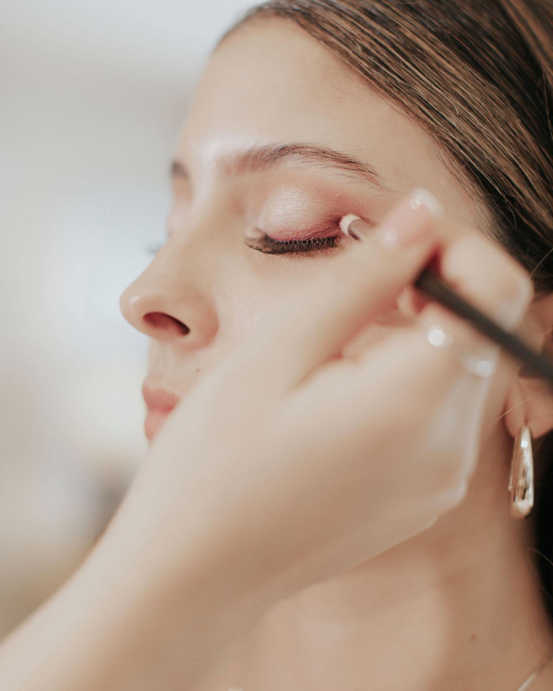

Todas las novias me hacen la misma pregunta en la prueba, normalmente hacia la segunda hora: _¿esto va a seguir aquí a medianoche?_

La respuesta honesta es que la duración tiene poco que ver con los productos que la gente imagina. No es el spray fijador. Son los veinte minutos antes de que entre la base, y un puñado de decisiones tomadas a la medida de tu piel.

## Empieza en la piel, no en el maquillaje

El maquillaje se asienta sobre lo que hay debajo. Si la piel está seca, el polvo se agarra a las zonas secas para la hora de comer. Si está produciendo grasa, la base se desliza. Ninguno de los dos es un defecto — son simplemente dos puntos de partida distintos que piden enfoques distintos.

La mañana de la boda le dedico tiempo real a esto: limpieza, una capa de hidratación adecuada a tu piel, y tiempo suficiente para que se absorba antes de que pase cualquier otra cosa. Saltarse ese paso es la razón más común de que el maquillaje ceda temprano.

:::tip[Lo único que hay que hacer una misma]
Exfolia suavemente **tres días** antes de la boda, no la víspera. La piel recién exfoliada queda ligeramente inflamada y recibe la base de forma irregular. Tres días le dan tiempo de asentarse.
:::

## Elegir la base para el día que realmente vas a tener

Una ceremonia al aire libre en el Algarve en agosto y una recepción a la luz de las velas en una quinta de Sintra en noviembre no son el mismo trabajo. El calor, la humedad y cuánto esperas llorar cambian aquello a lo que recurro.

| Tu día | Lo que funciona | Lo que evitar |
| --- | --- | --- |
| Calor, exterior, verano | Base ligera de larga duración, polvo solo donde hace falta | Base pesada de cobertura total |
| Fresco, interior, noche | Base luminosa, rubor en crema, polvo suave | Todo mate — se ve apagado con poca luz |
| Playa o costa | Base resistente al agua, rímel a prueba de agua | Fórmulas ligeras que piden retoque |
| Ceremonia emotiva | Delineador y pestañas a prueba de agua, labio sellado | Rímel no resistente, párpados con brillo |

Nada de esto se improvisa la mañana de la boda. Para eso está la prueba.

## Los tres productos que de verdad sostienen un look

1. **Una prebase elegida para tu piel, no para el acabado.** Las prebases de agarre y las difuminadoras hacen trabajos opuestos. Usar la equivocada es peor que no usar ninguna.
2. **A prueba de agua en los ojos, siempre.** Delineador, rímel y pestañas, si las llevas. En una boda esto no se negocia.
3. **Un labio por capas, sellado entre ellas.** Color, secar, color otra vez. Dura más que cualquier aplicación única y sobrevive a una copa de vino.

## Y cuando sí hace falta un retoque

Normalmente no hace falta, pero la versión honesta es: a las ocho horas, la zona T puede pedir papel matificante y el labio va a querer rehacerse después de la cena. Todas las novias con las que trabajo salen de la habitación con un kit pequeño — papeles matificantes, el labial y un polvo compacto del tono de su base. Dos minutos, una vez, basta.

:::note
Si te vas a maquillar tú misma, el kit importa más que la aplicación. Lleva el labial y un papel matificante y ya cubriste el noventa por ciento de lo que suele salir mal.
:::

## Verlo en la práctica

Este es un look de novia completo, de la preparación al resultado, grabado una mañana de boda en Lisboa:

https://www.youtube.com/watch?v=aqz-KE-bpKQ

Todo el enfoque se resume en una idea. El maquillaje de larga duración no es maquillaje sellado a la fuerza — es maquillaje construido para el día que de verdad vas a tener, sobre la piel que de verdad tienes.
